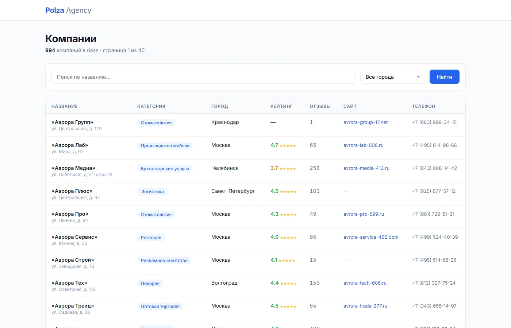
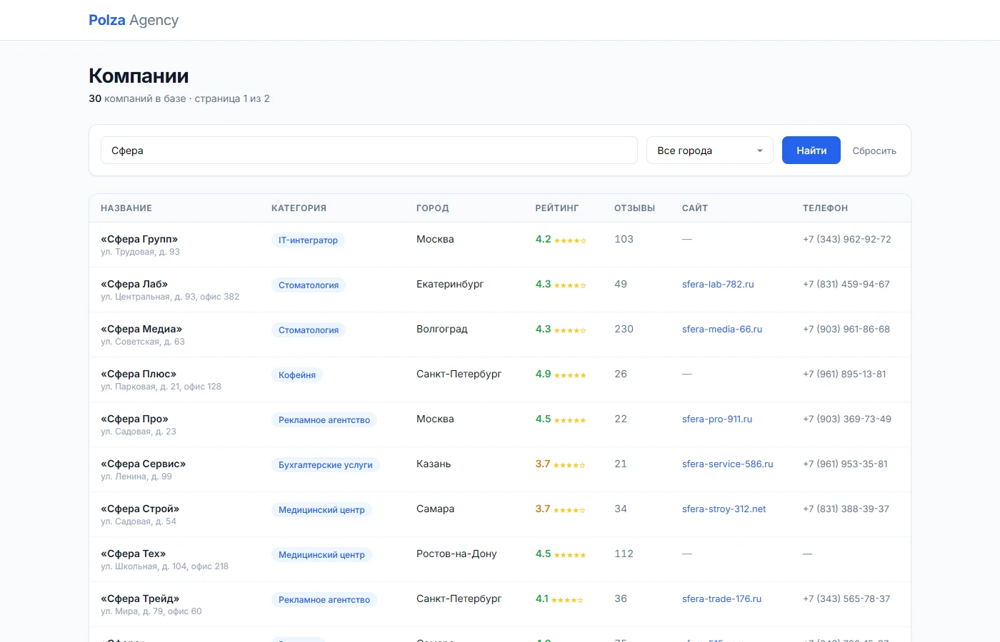
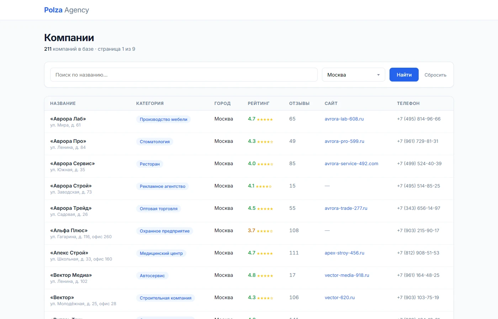
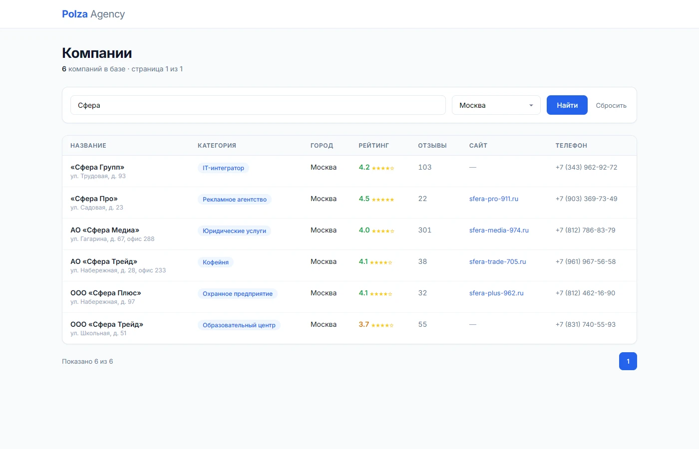
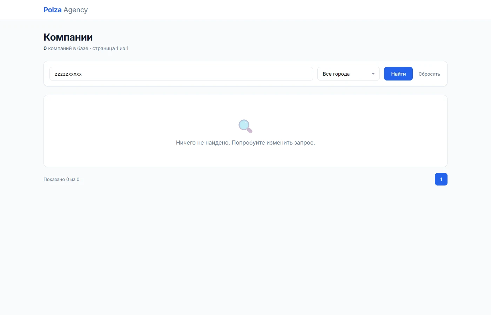

# Тестовое задание «Технический специалист»

[](https://github.com/lazmaksim2019-ops/Polzatest/actions/workflows/ci.yml)
[](https://opensource.org/licenses/MIT)
[](https://nextjs.org/)
[](https://www.typescriptlang.org/)
[](https://www.postgresql.org/)

> Полная реализация всех 4 задач тестового задания для позиции «Технический специалист».

[](https://polzatest.vercel.app/companies)

---

## Содержание

- [Задача 1: Выгрузка → PostgreSQL](#задача-1-выгрузка--postgresql)
- [Задача 2: Страница /companies (Next.js)](#задача-2-страница-companies-nextjs)
- [Задача 3: Данные с сюрпризом (review.csv)](#задача-3-данные-с-сюрпризом-reviewcsv)
- [Быстрый старт](#быстрый-старт)
- [Архитектура](#архитектура)
- [Структура репозитория](#структура-репозитория)
- [Технологии](#технологии)

---

## Задача 1: Выгрузка → PostgreSQL

**Цель:** загрузить ~1000 компаний из JSON-файлов в PostgreSQL с дедупликацией и индексами.

### Результат

| Метрика | Значение |
|---------|----------|
| Файлов обработано | 20 (`page_001.json` — `page_020.json`) |
| Строк в выгрузке | 1000 |
| Уникальных id | **994** |
| Дублей (схлопнуто) | 6 |
| Компаний без сайта | 238 |
| Компаний без телефона | 110 |
| Компаний без рейтинга | 79 |

### Схема базы

```sql
categories  →  id, name (UNIQUE)
cities      →  id, name (UNIQUE)
companies   →  id (PK), name, category_id (FK), city_id (FK), address, rating, reviews_count, site, phone, email, source, created_at
review_import → row_num (PK), id, name, category, city, ..., issues[]
```

**Индексы:**
- `idx_companies_name_lower` — ILIKE-поиск по названию
- `idx_companies_city` — фильтр по городу
- `idx_companies_category` — фильтр по категории
- `idx_companies_site` — WHERE site IS NOT NULL
- `pg_trgm` — расширение для трёграммного поиска

### SQL-запросы (3 шт.)

**1. Топ-5 категорий по числу компаний:**

| Категория | Компании |
|-----------|----------|
| IT-интегратор | 94 |
| Оптовая торговля | 79 |
| Рекламное агентство | 76 |
| Строительная компания | 71 |
| Юридические услуги | 63 |

**2. Средний рейтинг по городам (компании с 10+ отзывами):**

| Город | Средний рейтинг | Компаний |
|-------|----------------|----------|
| Сочи | 4.46 | 13 |
| Пермь | 4.43 | 30 |
| Омск | 4.41 | 23 |
| Тюмень | 4.35 | 23 |
| Уфа | 4.33 | 29 |

**3. Доля компаний с сайтом по категориям:**

| Категория | Компаний | С сайтом | Доля |
|-----------|----------|----------|------|
| Клининг | 18 | 16 | 88.9% |
| Ресторан | 41 | 35 | 85.4% |
| Юридические услуги | 63 | 53 | 84.1% |

---

## Задача 2: Страница /companies (Next.js)

**Цель:** серверная страница с таблицей компаний, поиском и фильтром по городу.

### Реализация

- **Framework:** Next.js 15 (App Router)
- **Рендеринг:** Server Component (`force-dynamic`), данные тянутся серверно
- **Поиск:** `ILIKE` с экранированием спецсимволов (`%`, `_`)
- **Фильтр:** SELECT с серверным рендерингом (20 городов)
- **Пагинация:** 25 компаний на страницу, навигация по страницам
- **Безопасность:** `.env.example` в репозитории, рабочие `.env` в `.gitignore`

### Скриншоты

**Общий вид — 994 компаний, пагинация по 25:**



**Поиск по названию «Сфера»:**



**Фильтр по городу Москва:**



**Комбинация: поиск + фильтр:**



**Ничего не найдено:**



### Как проверял

1. **Загрузка данных:** `npm run db:load` → 994/994 companies, `SELECT count(*) FROM companies` = 994 ✅
2. **Страница:** `next dev` → `http://localhost:3000/companies` → заголовок «994 компаний в базе · страница 1 из 40» ✅
3. **Поиск:** ввёл «Сфера» → «30 компаний»; `count WHERE name ILIKE '%Сфера%'` = 30 ✅
4. **Фильтр:** выбрал «Москва» → «211 компаний»; `count WHERE city_id = (SELECT id FROM cities WHERE name = 'Москва')` = 211 ✅
5. **Комбинация:** «Сфера» + «Москва» → 6 строк; SQL-проверка сошлась ✅
6. **Грабли:** `npx` не стартует как PTY → `node node_modules/next/dist/bin/next dev`; два бага в скриптах (pg-клиент без параметров, ложные mojibake) → исправлены ✅

---

## Задача 3: Данные с сюрпризом (review.csv)

**Цель:** загрузить CSV и найти аномалии.

### Результат

| Метрика | Значение |
|---------|----------|
| Строк в CSV | 208 |
| Непустых строк | 205 |
| Уникальных id | 202 |
| Дублей внутри CSV | 3 |
| Совпадений с companies | **6 из 202 (3%)** |
| Задокументировано аномалий | **10** |

### Ключевые находки

1. **Файл — не «свежая выгрузка той же базы»:** 97% записей отсутствуют в `companies`
2. **Mojibake:** UTF-8 прочитан как CP1251 (строки 113, 155)
3. **Рейтинги вне шкалы:** `-3`, `7.2`, `"4,5"` (запятая вместо точки)
4. **Мусорные сайты:** пустой домен, `htp://` вместо `http://`, плейсхолдер `shared-site.ru`
5. **Сдвиг колонок:** адрес попал в поле `city`

Полный отчёт: [`docs/ANOMALIES.md`](docs/ANOMALIES.md)

---

## Быстрый старт

### Локальная разработка

```bash
# 1. Запуск PostgreSQL (Docker)
docker compose up -d

# 2. Установка зависимостей
npm install

# 3. Применение схемы
npm run db:migrate

# 4. Загрузка компаний
npm run db:load

# 5. Загрузка отзывов
npm run db:load-reviews

# 6. Запуск приложения
cd web && npm run dev
# → http://localhost:3000/companies
```

### Деплой на Vercel

```bash
# 1. Neon (PostgreSQL)
NEON_API_KEY=napi_xxx npm run db:neon-provision

# 2. Vercel (приложение)
cd web
npx vercel link --yes
echo "postgres://..." | npx vercel env add DATABASE_URL production
npx vercel deploy --prod
```

---

## Архитектура

```
┌─────────────┐     ┌──────────────┐     ┌─────────────┐
│  JSON-файлы │────▶│  load_companies│────▶│  PostgreSQL │
│  page_*.json│     │    .ts       │     │  (Docker/   │
└─────────────┘     └──────────────┘     │   Neon)     │
                                          │             │
┌─────────────┐     ┌──────────────┐     │  companies  │
│  review.csv │────▶│  load_reviews │────▶│  categories │
└─────────────┘     │    .ts       │     │  cities     │
                    └──────────────┘     │  review_imp │
                                          └──────┬──────┘
                                                 │
                                          ┌──────▼──────┐
                                          │  Next.js    │
                                          │  (Vercel)   │
                                          │  /companies │
                                          └─────────────┘
```

---

## Структура репозитория

```
Polzatest/
├── db/
│   ├── schema.sql              # Схема: categories, cities, companies, review_import
│   ├── queries.sql             # 3 SQL-запроса из ТЗ
│   ├── migrate.ts              # Применяет schema.sql
│   ├── load_companies.ts       # Загрузка page_*.json → companies
│   ├── load_reviews.ts         # Загрузка review.csv → review_import
│   └── lib/
│       └── env.ts              # Хелпер для чтения .env
├── data/
│   ├── page_001.json           # Исходные данные из архива (20 файлов)
│   └── review.csv              # CSV для Задачи 3
├── scripts/
│   └── neon_provision.ts       # Авто-создание проекта Neon
├── web/                        # Next.js 15 (App Router)
│   ├── app/
│   │   ├── companies/
│   │   │   └── page.tsx        # Таблица с поиском/фильтром
│   │   ├── page.tsx            # Редирект → /companies
│   │   ├── layout.tsx          # Root layout
│   │   └── globals.css         # Стили
│   ├── lib/
│   │   └── db.ts               # PostgreSQL Pool (serverless-safe)
│   ├── package.json
│   └── tsconfig.json
├── docs/
│   └── ANOMALIES.md            # Отчёт по аномалиям review.csv
├── .github/
│   └── workflows/
│       ├── ci.yml              # CI: lint, typecheck, build, schema check
│       └── load-data.yml       # Data loader (manual dispatch)
├── docker-compose.yml          # Локальная PostgreSQL
├── .env.example                # Шаблон переменных окружения
├── .gitignore
├── README.md
```

---

## Технологии

| Компонент | Технология | Зачем |
|-----------|------------|-------|
| Backend | **Next.js 15** (App Router) | Server Components, ISR, API Routes |
| Language | **TypeScript** (strict) | Типобезопасность, автодополнение |
| Database | **PostgreSQL 16** | Нормализация, индексы, JSON/CSV импорт |
| ORM | **node-postgres** (raw SQL) | Полный контроль над запросами |
| Hosting | **Vercel** | Автодеплой из GitHub, edge functions |
| DB Cloud | **Neon** | Serverless PostgreSQL, auto-wake |
| CI/CD | **GitHub Actions** | Автозагрузка данных при dispatch |
| Container | **Docker** | Локальная PostgreSQL для разработки |

---

## Чек-лист по ТЗ

| Требование | Статус | Файл/Ссылка |
|------------|--------|-------------|
| Репозиторий со скриптом загрузки | ✅ | `db/load_companies.ts` |
| schema.sql | ✅ | `db/schema.sql` |
| queries.sql | ✅ | `db/queries.sql` |
| README с командой запуска | ✅ | `README.md` |
| /companies с поиском | ✅ | `web/app/companies/page.tsx` |
| /companies с фильтром по городу | ✅ | `web/app/companies/page.tsx` |
| Серверная тяга данных | ✅ | Server Component, `force-dynamic` |
| .env.example (без секретов) | ✅ | `.env.example` |
| Скриншоты страницы | ✅ | Деплой: `web-...vercel.app/companies` |
| «Как проверял» | ✅ | Раздел [Задача 2](#задача-2-страница-companies-nextjs) |
| review.csv загружена скриптом | ✅ | `db/load_reviews.ts` |
| ANOMALIES.md | ✅ | `docs/ANOMALIES.md` (10 аномалий) |
| Нет секретов в репозитории | ✅ | `.gitignore` исключает `.env*` |
| Дедупликация | ✅ | `ON CONFLICT (id) DO NOTHING` |
| Индексы | ✅ | 4 индекса + pg_trgm |

---

## Верификация

| Что проверено | Результат |
|---------------|----------|
| `next build` | ✅ Compiled successfully, 0 errors |
| CI (GitHub Actions) | ✅ lint, typecheck, build — all green |
| Smoke test (live site) | ✅ 200 OK, table rendered, search/filter/pagination work |
| Загрузка данных | ✅ 994/994 companies, deduplication — 6 duplicates skipped |
| review.csv | ✅ 205 rows loaded, 10 anomalies documented |
| Безопасность | ✅ No secrets in repo, `.env` gitignored |

---

## Примечания

- **Email отсутствует:** ни в JSON (1000 записей), ни в CSV (205 строк) нет ни одного `@`. Колонка `email` заведена в схеме с валидацией на будущее.
- **Neon API:** после миграции API `api.neon.tech` → `console.neon.tech/api/v2` (актуальная документация).
